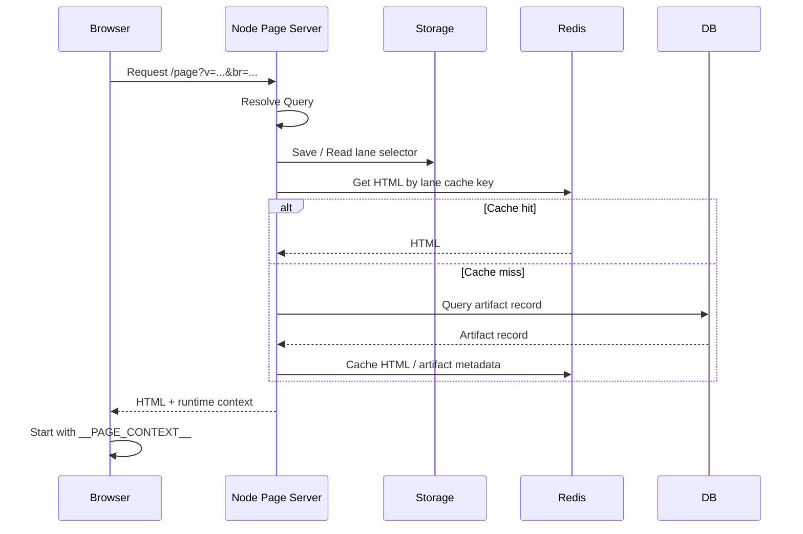
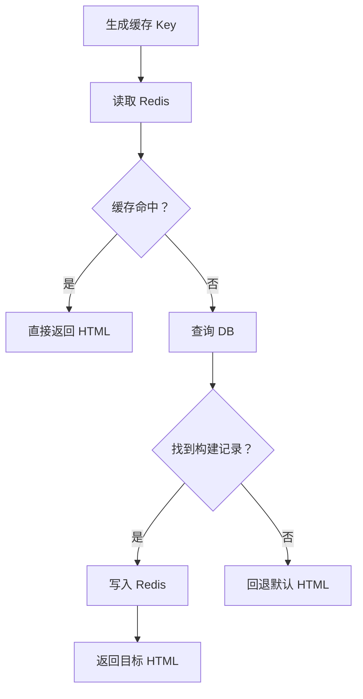
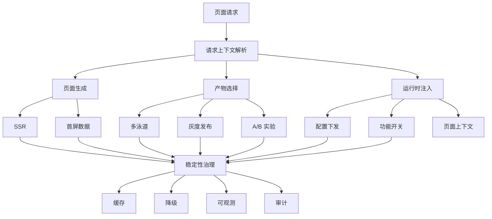

## 背景：为什么需要 Node Page Server

不同业务引入 Node Page Server 的出发点可能完全不同。

有些业务需要 SSR，希望服务端直接渲染首屏 HTML，减少白屏时间，同时兼顾 SEO；有些业务不需要完整 SSR，只是希望在 HTML 中注入首屏数据，避免浏览器启动后再额外请求一轮接口；有些业务需要根据登录态、租户、地区、设备类型或 AB 分组决定页面上的初始状态；还有些业务只是希望把运行时配置、静态资源地址、构建版本、灰度标识和功能开关统一注入到页面里。

再往工程治理看，Node Page Server 还可能承担前端构建产物的选择、回滚、缓存、降级、访问追踪和版本展示。也就是说，页面请求进入服务端之后，服务端并不只是“返回一个 index.html”，而是在组织一次业务页面运行所需的初始环境。

当业务复杂度上来之后，这些职责很难继续散落在 Nginx 配置、静态文件目录、前端运行时代码或临时脚本里。页面请求进入服务端之后，需要有一个明确的服务承载这些能力。

这就是本文讨论的 **Node Page Server**。

下面会按模块展开这些职责。每个模块都对应一类具体业务诉求，它们可以单独存在，也可以组合成完整的前端页面服务层。

---

## SSR：服务端生成首屏 HTML

SSR 是很多业务引入 Node Page Server 的直接原因。

在纯 CSR 模式下，服务端通常只返回一个空壳 HTML，浏览器加载 JS 后再请求数据、执行渲染。这个模式实现简单，但首屏内容依赖 JS 加载和接口请求，容易出现白屏时间较长、SEO 不友好、弱网体验差等问题。

如果业务需要更快的首屏展示，或者页面内容需要被搜索引擎、分享卡片、爬虫系统识别，就可以让 Node Page Server 在请求阶段完成 HTML 生成。

典型链路如下：

```txt
Browser
  ↓
Node Page Server
  ↓
Load Page Data
  ↓
Render HTML
  ↓
Inject Runtime Context
  ↓
HTML Response
```

SSR 场景下，Node Page Server 需要承担的不只是返回 HTML 文件，而是要根据请求上下文组织页面数据，并生成带内容的 HTML。

```ts
async function renderPage(req) {
  const context = resolveRequestContext(req)
  const pageData = await loadPageData(context)
  const html = await renderToHtml({
    context,
    pageData
  })

  return injectRuntimeContext(html, {
    pageData,
    context
  })
}
```

SSR 不一定适合所有页面。对于强交互后台系统来说，它的收益可能不如首屏数据注入明显；对于内容型、营销型、搜索曝光型页面来说，SSR 的收益通常更直接。

---

## 首屏数据注入：减少启动后的额外请求

有些业务并不需要完整 SSR，但仍然希望 Node Page Server 在 HTML 中注入首屏数据。

这种模式介于纯 CSR 和 SSR 之间。HTML 仍然可以由前端构建产物提供，页面渲染仍然主要发生在浏览器，但首屏所需的数据可以由 Node Page Server 在返回 HTML 前准备好。

```html
<script>
  window.__INITIAL_DATA__ = {
    user: {
      id: "u_10001",
      name: "Chanx"
    },
    page: {
      title: "Order Detail",
      permissions: ["read", "refund"]
    }
  }
</script>
```

这样浏览器启动后可以直接消费 `window.__INITIAL_DATA__`，不必为了用户信息、权限、页面基础配置再发起一轮阻塞首屏的接口请求。

首屏数据注入需要注意数据边界。Node Page Server 适合注入页面启动必须的数据，例如用户态、权限、租户、页面配置、关键业务数据摘要；不适合把大列表、复杂报表或高频变化数据全部塞进 HTML。

---

## 多泳道

多泳道解决的是研发协作问题。

测试、产品、研发希望在同一个页面入口下访问不同分支、不同版本或不同测试环境对应的前端页面，而不需要额外安装插件、手动切 Header，或者记住一堆临时访问地址。

在 Node Page Server 里，多泳道可以被理解为一次页面请求的上下文选择过程：

```txt
Query -> Storage -> Node -> DB -> Redis -> HTML
```

这条链路表达的是：用户可以通过 Query 指定泳道，Node Page Server 把选择结果持久化到 Storage，再在后续请求中恢复上下文，查询 DB 中的构建记录，优先读取 Redis 缓存，最终返回对应 HTML。

完整链路如下：



对应职责可以拆成几层。

| 模块               | 职责                                  |
| ---------------- | ----------------------------------- |
| Query            | 当前访问显式指定泳道，例如 `br` 或 `v`          |
| Storage          | 保存用户已经选择过的泳道，避免页面跳转后丢失上下文        |
| Node Page Server | 读取 Query / Storage，解析出当前页面请求应命中的泳道 |
| DB               | 保存泳道、版本、构建 hash、HTML 地址等构建记录       |
| Redis            | 缓存最终 HTML 或构建记录，降低 DB / 对象存储压力     |
| HTML             | 返回最终页面，并注入当前泳道、版本、构建 hash 等上下文    |

在这个阶段，系统解决的是一个基础问题：

```txt
同一个页面入口，如何根据访问上下文命中不同泳道？
```

其中 `br` 通常表示分支或泳道，`v` 通常表示具体构建版本。

### Query：显式指定泳道

Query 是多泳道最直接的入口。

多泳道最常见的 Query 参数是 `v` 和 `br`。

| 参数   | 含义      | 说明             |
| ---- | ------- | -------------- |
| `v`  | version | 表示具体的前端构建版本    |
| `br` | branch  | 表示分支、泳道或测试环境标识 |

`v` 解决“访问哪个版本”的问题，`br` 解决“访问哪个分支或泳道”的问题。

只传 `v` 时：

```txt
/page?v=20260513-001
```

语义是访问某个明确的构建版本。这适合固定版本验收、Bug 精确复现、版本对比等场景。

只传 `br` 时：

```txt
/page?br=feat-order-page
```

语义是访问某个分支或泳道。这适合日常联调、功能分支验收和测试环境访问。

同时传 `v` 和 `br` 时：

```txt
/page?v=20260513-001&br=feat-order-page
```

语义是同时携带版本和分支两个维度的信息。这对环境展示、问题排查和埋点分析更友好。

这里不需要在文章里展开 `v` 和 `br` 的优先级策略。不同业务可以根据自己的构建产物模型决定解析规则。关键是 Node Page Server 最终要解析出一份明确的页面产物。

### Storage：保存泳道上下文

Query 表示用户当前访问显式指定了泳道，但它不适合作为唯一状态来源。页面跳转时 Query 可能丢失，业务代码也可能重写 URL。如果每次跳转都要求前端业务代码手动透传 `v` 和 `br`，维护成本会很高。

因此，Query 更适合作为入口参数。首次访问时，Node Page Server 从 Query 中读取 `v` 和 `br`，然后写入一个 Node 可读的 Storage。后续访问即使 URL 中不再携带这些参数，Node Page Server 仍然可以恢复上下文。

在基础场景下，泳道上下文的优先级可以是：

```txt
Query > Storage > Default
```

Query 表示用户当前访问明确指定了泳道。Storage 表示用户之前选择过泳道。Default 表示没有任何选择条件时使用默认页面。

常见存储方式对比如下：

| 存储方式           |   Node 首屏可读 |             前端可读 |       自动随请求携带 |   适合作为主状态 |
| -------------- | ----------: | ---------------: | ------------: | --------: |
| Query          |           是 |                是 |   是，体现在 URL 中 |    否，适合入口 |
| Cookie         |           是 | 取决于是否 `httpOnly` |             是 |         是 |
| Server Session |           是 |                否 | 通过 Session ID |         是 |
| localStorage   |           否 |                是 |             否 |         否 |
| sessionStorage |           否 |                是 |             否 |         否 |
| Header         |           是 |        需要客户端主动设置 |             是 | 不适合普通用户入口 |
| HTML 注入变量      | 否，属于服务端解析结果 |                是 |             否 |         否 |

在 `Browser -> Node Page Server -> HTML Template` 链路下，Cookie 或 Server Session 更适合作为主状态。因为 Node Page Server 必须在下发 HTML 之前读到当前选择条件。

如果使用 Cookie，可以只保存选择条件：

```json
{
  "v": "20260513-001",
  "br": "feat-order-page"
}
```

Cookie 中不应该保存 HTML、完整配置、分支列表等大对象。它只需要保存选择条件。

### Node：解析当前请求命中的泳道

Node Page Server 负责把 Query 和 Storage 合并成一次页面请求的泳道上下文。

```ts
type LaneSelector = {
  v?: string
  br?: string
  source: 'query' | 'storage' | 'default'
}

function resolveLaneSelector(req, res): LaneSelector {
  const queryV = req.query.v
  const queryBr = req.query.br

  if (queryV || queryBr) {
    const selector: LaneSelector = {
      v: queryV,
      br: queryBr,
      source: 'query'
    }

    saveLaneSelector(res, selector)

    return selector
  }

  const storedSelector = getStoredLaneSelector(req)

  if (storedSelector) {
    return {
      ...storedSelector,
      source: 'storage'
    }
  }

  return {
    source: 'default'
  }
}
```

写入 Storage 的逻辑可以很简单：

```ts
function saveLaneSelector(res, selector: LaneSelector) {
  res.cookie(
    'lane_selector',
    JSON.stringify({
      v: selector.v,
      br: selector.br
    }),
    {
      maxAge: 3 * 24 * 60 * 60 * 1000,
      sameSite: 'lax',
      path: '/'
    }
  )
}
```

读取逻辑：

```ts
function getStoredLaneSelector(req): Partial<LaneSelector> | null {
  const raw = req.cookies?.lane_selector

  if (!raw) {
    return null
  }

  try {
    const selector = JSON.parse(raw)

    if (!selector.v && !selector.br) {
      return null
    }

    return {
      v: selector.v,
      br: selector.br
    }
  } catch {
    return null
  }
}
```

这里的重点不是把所有策略写死，而是把请求稳定地解析成一个可用于查询 DB 和 Redis 的泳道选择器。

### DB：查询泳道对应的构建记录

Node Page Server 拿到泳道选择器后，需要去 DB 查询当前泳道对应的构建记录。

DB 中不一定要保存完整 HTML，也可以只保存 HTML 或模板的存储地址。多泳道链路真正需要的是能从 `v`、`br`、默认规则中找到一份明确的构建记录。

| 字段               | 含义                   |
| ---------------- | -------------------- |
| `id`             | 构建记录 ID              |
| `version`        | 构建版本                 |
| `branch`         | 分支或泳道标识              |
| `html`           | HTML 内容，或者 HTML 存储地址 |
| `asset_base_url` | 静态资源基础路径             |
| `build_hash`     | 构建 hash              |
| `is_default`     | 是否默认构建               |
| `created_at`     | 构建时间                 |

这里不需要展开完整的构建产物模型。对多泳道来说，DB 的职责就是保存“泳道选择条件”和“可返回页面”之间的映射。

### Redis：缓存最终命中的 HTML

DB 是权威数据源，Redis 更适合作为缓存层。

缓存 Key 可以围绕版本、分支等选择条件设计。

```txt
lane:html:v:20260513-001
lane:html:br:feat-order-page
lane:html:v:20260513-001:br:feat-order-page
lane:html:default
```

典型查询流程是：



示例代码：

```ts
async function getLaneHtml(selector: LaneSelector) {
  const cacheKey = buildLaneCacheKey(selector)

  const cachedHtml = await redis.get(cacheKey)

  if (cachedHtml) {
    return cachedHtml
  }

  const record = await queryLaneRecordFromDatabase(selector)

  if (!record) {
    return getDefaultHtml()
  }

  await redis.set(cacheKey, record.html, {
    EX: 60 * 10
  })

  return record.html
}
```

Redis 只是缓存层，不能作为唯一数据源。泳道和构建记录的权威数据仍然应该保存在 DB 或对象存储中。

### HTML：返回页面并注入运行时上下文

Node Page Server 查询到目标页面产物后，需要在 HTML 中注入运行时上下文。

这一步的目的不是决定页面产物，而是让浏览器运行时知道当前页面产物是什么。

示例：

```html
<script>
  window.__PAGE_CONTEXT__ = {
    artifact: {
      v: "20260513-001",
      br: "feat-order-page",
      buildHash: "a1b2c3d",
      source: "query"
    },
    assets: {
      baseUrl: "https://cdn.example.com/assets/20260513-001/"
    }
  }
</script>
```

完整顺序是：

```txt
Query
  ↓
Storage
  ↓
Node Page Server
  ↓
DB
  ↓
Redis
  ↓
HTML
  ↓
Browser Runtime
```

`window.__PAGE_CONTEXT__` 是服务端解析后的结果，不是服务端解析前的依据。

### 多泳道访问

多泳道真正解决的是协作问题。测试、产品、研发可以在同一个页面入口下访问不同分支对应的构建产物，而不需要额外安装插件或手动设置 Header。

页面侧最好展示当前构建信息：

```txt
BR: feat-order-page
V: 20260513-001
Hash: a1b2c3d
Source: storage
```

这类展示不是锦上添花，而是多泳道协作中的可观测性能力。很多环境问题不是功能有问题，而是访问的页面产物不一致。展示 `br`、`v` 和 `buildHash` 后，反馈 Bug 时可以直接截图确认环境。

---

## 配置下发：把运行时差异留在服务端

在 Node Page Server 已经可以选择页面产物之后，它还可以继续承担运行时配置下发能力。

配置下发不是页面产物下发的前置条件，而是 Node Page Server 可以独立承载的一类运行时能力。

例如，不同分支使用不同 API 地址，不同版本启用不同实验功能，不同环境注入不同调试配置。

```html
<script>
  window.__APP_CONFIG__ = {
    apiBaseUrl: "https://api-test.example.com",
    enableNewOrderPage: true,
    uploadLimit: 20
  }
</script>
```

这类配置可以跟随页面产物一起下发，也可以由 Node Page Server 根据当前 `v`、`br`、用户信息或业务规则动态生成。

此时，Node Page Server 不仅在选择 HTML，也开始影响页面运行时行为。

---

## 灰度发布：按用户或规则选择页面能力

灰度发布是在页面产物选择机制上继续增加用户维度。

在 `v` / `br` 场景中，选择条件主要来自用户显式传入的 URL 参数。在灰度场景中，选择条件可能来自用户 ID、部门、白名单或分桶结果。

示例：

```ts
function resolveGrayVersion(uid: string) {
  const bucket = hash(uid) % 100

  if (bucket < 10) {
    return '20260513-001'
  }

  return 'default'
}
```

这时，`v` 不一定来自 Query，而可能来自灰度规则计算结果。

也就是说，Artifact Selector 的来源从显式参数扩展成了规则计算：

```txt
Query / Storage / Default
        ↓
User / Bucket / Gray Rule
        ↓
Artifact Selector
        ↓
Frontend Artifact
```

灰度发布不是凭空出现的能力。它依赖前面已经建立好的页面产物选择和下发机制。

---

## A/B 实验：在页面入口完成实验分组

A/B 实验和灰度发布类似，但目标不同。

灰度发布关注发布风险控制，A/B 实验关注不同版本或配置对业务指标的影响。

Node Page Server 可以在页面下发阶段完成实验分组，并注入实验上下文：

```html
<script>
  window.__EXPERIMENT_CONTEXT__ = {
    experimentKey: "new_order_page",
    group: "B",
    version: "20260513-b"
  }
</script>
```

如果实验差异很大，可以下发不同页面产物。如果实验差异较小，也可以下发相同页面产物，但注入不同运行时配置。

这说明页面产物下发和运行时配置下发可以组合使用。前者控制“下发哪份页面”，后者控制“页面如何运行”。

---

## 功能开关：功能级运行时控制

功能开关是更细粒度的运行时控制。

相比通过 `v` 或 `br` 切换整份页面产物，功能开关更关注功能级别的启停。

示例：

```html
<script>
  window.__FEATURE_FLAGS__ = {
    enableNewOrderPage: true,
    enablePaymentV2: false
  }
</script>
```

Node Page Server 可以根据当前页面产物、用户身份、灰度规则或配置中心结果，下发不同功能开关。

从能力层级上看，功能开关已经不再只是“页面产物选择”，而是基于页面请求上下文做运行时能力控制。

---

## 稳定性治理：降级、缓存与可观测

Node Page Server 位于页面请求入口，一旦它承担 SSR、首屏数据注入、页面产物选择、配置下发等能力，就必须同时考虑稳定性治理。

以多泳道为例，系统一定要处理异常情况。例如 `v` 或 `br` 无效、缓存未命中、数据库查询失败、对象存储读取失败等。

比较稳妥的处理方式是，当选择条件无法解析到有效页面产物时，回退到默认构建，并在上下文中标记 fallback 状态。

可以定义上下文结构：

```ts
type PageContext = {
  artifact?: {
    v?: string
    br?: string
    buildHash?: string
  }
  source: 'query' | 'storage' | 'default'
  fallback?: boolean
  fallbackReason?: string
}
```

页面展示时可以明确显示当前命中的是默认构建，避免用户误以为自己仍然访问的是目标版本或目标分支。

静默降级容易制造新的排查问题。对内部研发协作场景来说，明确展示 fallback 状态更有价值。

除了降级，Node Page Server 还需要考虑缓存和可观测性。

| 治理项 | 说明 |
| --- | --- |
| 缓存 | 对 HTML、配置、首屏数据或产物元信息做分层缓存，降低后端依赖压力 |
| 降级 | 当产物、配置、实验或数据读取失败时，回退到默认页面或默认配置 |
| 可观测 | 在页面上下文中暴露版本、分支、构建 hash、配置来源、fallback 状态等信息 |
| 审计 | 记录用户实际命中的页面产物、实验分组和功能开关，方便排查线上问题 |

Node Page Server 越靠近页面入口，越需要把稳定性治理作为基础能力，而不是等出问题后再补。

---

## 能力分层

把前面的模块合在一起看，Node Page Server 承接的是页面进入浏览器之前的服务化入口能力。



---

## 总结

Node Page Server 不是为了某一个单点能力存在的。它更像是前端页面进入浏览器之前的一层服务化入口，用来承接页面初始化过程中那些不适合继续散落在静态文件、Nginx 配置、前端运行时代码里的职责。

从业务诉求出发，它可以承载 SSR、首屏数据注入、多泳道、配置下发、灰度发布、A/B 实验、功能开关和稳定性治理等模块。这些模块没有固定先后顺序，也不需要一次性全部建设。内容型页面可能先需要 SSR，后台系统可能先需要首屏数据和配置注入，研发协作场景可能先需要多泳道，平台型业务则更容易继续发展出灰度、实验和功能开关。

真正重要的是把职责边界想清楚：Node Page Server 负责在页面请求阶段读取上下文、组织 HTML、注入运行时信息，并保证这条链路可缓存、可降级、可观测。只要这个边界清晰，后续无论是增加新模块，还是收敛已有能力，都不会把前端页面入口变成一堆临时逻辑的集合。
